\newpage

# Abstract

This project evaluate whether standard machine learning models outperform simple baselines for short horizon forecasts of Swiss CPI inflation (YoY). We used monthly CPI and related macro series to build a reproducible pipeline. It contains horizon aware lagged features, time series cross validation, and out of fold evaluation. Linear, Ridge, Lasso, and Random Forest are benchmarked against Naive (direct horizon persistence) and Seasonal Naive (12 month persistence). For 1 and 3 month horizons, the Naive baseline consistently matches or exceeds ML performance; Seasonal Naive is competitive when seasonal patterns dominate. These results indicate that, at near‑term horizons, added model complexity does not reliably reduce forecast error. Our contributions are a deterministic forecasting framework, a rigorous baseline comparison, and interpretable diagnostics (permutation importance, correlation heatmaps) with clearly versioned artifacts.

**Keywords:** inflation, CPI, Switzerland, time series, forecasting, baselines, machine learning

# Introduction

Inflation forecasting is central to macroeconomic monitoring, monetary policy, and business planning. In Switzerland, CPI year-over-year (YoY) changes are relatively stable compared to many peers. So when thinking about a project related to inflation, I wondered if standard machine learning models could meaningfully improve short horizon forecasts over simple persistence baselines? Because our first thought is like "Surely this month's inflation isn't going to be far from last month's right ?". Well that is what we are going to analyze and compare in this project.

This work focuses on 1 and 3 month ahead forecasts of Swiss CPI YoY using monthly CPI and related macro indicators. The core problem is to assess whether commonly used models like Linear Regression, Ridge, Lasso, and Random Forest will deliver lower forecast errors than Naive and Seasonal Naive baselines.

Our objectives are the following : First, build a reproducible forecasting pipeline with time‑based splits and features adapted to the forecast horizon. Then, compare ML models to strong baselines via out of fold evaluation. Provide interpretability through permutation importance and correlation analysis, and finally generate operational forecasts.
\newpage

# Literature Review

Forecasting inflation has obviously a long tradition in macroeconomics. A standard benchmark is the random walk or Naive forecast, which simply projects the most recent inflation rate forward. Atkeson and Ohanian (2001) show that such simple forecasts often perform as well as, or better than, more elaborate Phillips curve models for U.S. inflation. This result has motivated a large literature comparing parsimonious benchmarks to more complex econometric specifications, particularly at short horizons.

Another influential line of work studies multivariate time series models and large macroeconomic datasets. Stock and Watson (2007, 2008) used factor models and many predictors to forecast inflation. Results showed that gains over naive benchmarks are modest and sensitive to specification. Similar studies apply ARIMA and VAR type models to exploit information from real activity or financial indicators. Overall, the evidence suggests that complex models or with many parameters rarely beat simple persistence forecasts.

In more recent work, machine learning approaches have also been used for inflation forecasting. Studies such as Medeiros et al. (2019) examine the use of Lasso based regularization, tree based ensemble methods, and other nonlinear models applied to high dimensional macroeconomic data. These approaches can capture interactions and nonlinearities, but empirical results remain mixed. In many settings, ML models deliver improvements mainly at longer horizons or during periods of structural change, while at short horizons they often track naive or seasonally adjusted benchmarks. 
Our project fits into this literature by testing whether common ML models meaningfully outperform Naive and Seasonal Naive baselines for Swiss CPI year on year inflation. 

# Methodology

## Data Description
The forecasting dataset is a monthly panel of Swiss macroeconomic series that goes from roughly 2000 to 2025. The dependent variable is the year over year Swiss CPI inflation. The set of predictors includes exchange rates, an energy price index, a global economic policy uncertainty index, the Swiss unemployment rate, the SNB policy rate, and a Google Trends based indicator of inflation related search intensity. We include these series because the Swiss inflation is affected by both domestic conditions and external pressures.

\begingroup
\small
\setlength{\tabcolsep}{3.5pt}
\renewcommand{\arraystretch}{0.95}

| Variable        | Description                                      | Source             | Notes / Transformation                |
|----------------|--------------------------------------------------|--------------------|---------------------------------------|
| `cpi_yoy`      | Swiss CPI, year over year % change              | SNB (data.snb.ch)  | Cleaned SNB CSV, monthly date index   |
| `eur_chf`      | Nominal EUR/CHF exchange rate                   | SNB                | Level, aligned with CPI               |
| `usd_chf`      | Nominal USD/CHF exchange rate                   | SNB                | Level, aligned with CPI               |
| `energy_idx`   | Energy price index (CPI sub‑index or series)    | SNB                | Restricted to 2000–2025               |
| `epu_global`   | Global Economic Policy Uncertainty index        | EPU project        | Matched to Swiss sample window        |
| `unemp_rate`   | Swiss unemployment rate                         | OFS                | Standardized, aligned with CPI        |
| `snb_policy`   | SNB policy rate / target range                  | SNB                | SNB format cleaned, monthly index     |
| `gt_trends`    | Google Trends index for inflation related terms | Google Trends      | Normalized search intensity, aligned  |

\endgroup

*Table 1: Summary of the main variables and transformations used in the forecasting dataset.*

## Approach and Metrics
The forecasting task is to predict Swiss CPI YoY one and three months ahead. For each horizon, we construct lagged versions of the target and explanatory variables to capture persistence and macroeconomic dynamics. These horizon specific feature sets are then used to estimate separate forecasting models for  1 and 3 month ahead inflation.

**Models compared**

- **Baselines:**
    - Naive: projects the most recent observed CPI YoY directly to the forecast horizon (in words: “inflation at time ($t+h$) equals inflation at time ($t$)”, i.e., $\hat{\pi}_{t+h\mid t}=\pi_t$).
    - Seasonal Naive: reuses the CPI YoY value from the same month one year earlier (i.e., $\hat{\pi}_{t+h\mid t}=\pi_{t-12}$).
- **Machine learning models:**
    - Linear Regression (OLS): linear predictor $\hat{\pi}_{t+h\mid t}=\beta_0 + \mathbf{x}_t^\top\beta$.
    - Ridge Regression: same linear form, with $\ell_2$ regularization (minimizes $\sum e_t^2 + \lambda\lVert\beta\rVert_2^2$).
    - Lasso Regression: same linear form, with $\ell_1$ regularization (minimizes $\sum e_t^2 + \lambda\lVert\beta\rVert_1$).
    - Random Forest regression: nonlinear ensemble of decision trees, with prediction $\hat{\pi}_{t+h\mid t}=\frac{1}{B}\sum_{b=1}^{B} T_b(\mathbf{x}_t)$.

Hyperparameters are kept fixed to keep the benchmark comparison simple.

**Backtesting and evaluation metrics**

- **Time series cross validation:** Rolling or expanding window scheme that mimics real time forecasting, always training on past data and evaluating on future observations.
- **Error metrics:** Root Mean Squared Error (RMSE), Mean Absolute Error (MAE), and Mean Absolute Scaled Error (MASE) computed out of sample for each model and horizon. MASE scales each model’s MAE by the Naive baseline MAE on the same evaluation window (so MASE < 1 indicates improvement over Naive).
- **Model comparison:** Performance is assessed by comparing RMSE/MAE/MASE of ML models against the Naive and Seasonal Naive benchmarks. The emphasis is on whether added complexity yields consistent gains at short horizons.

# Results

## Performance Evaluation
Tables 2 and 3 report the out of sample performance of all models for the 1 and 3 month ahead horizons, respectively. Errors are computed from out of fold (OOF) predictions produced by the rolling time series cross validation described above.

Here, “out of fold” means that each prediction is produced for an observation when it is in the held out test fold, using a model trained only on past data from the corresponding training window. It is combining the predictions from all folds results in a complete out of sample prediction series.

**1 month ahead forecasts (h = 1)**

| Model             | RMSE   | MAE   | MASE | n_samples |
|-------------------|--------|-------|------|-----------|
| Naive             | 0.27   | 0.20  | 1.00 | 255       |
| Lasso             | 0.87   | 0.65  | 3.19 | 255       |
| Ridge             | 1.13   | 0.81  | 3.99 | 255       |
| Random Forest     | 1.13   | 0.79  | 3.92 | 255       |
| Seasonal Naive    | 1.33   | 1.06  | 5.25 | 255       |
| Linear Regression | 1.49   | 0.98  | 4.87 | 255       |

*Table 2: OOF performance for 1 month ahead CPI YoY forecasts (rounded values).*

At the 1 month horizon, the Naive baseline clearly dominates. It achieves the lowest RMSE and MAE, and by construction has MASE = 1. All machine learning models have MASE well above 1, indicating that they are, on average, several times worse than the Naive forecast. The Seasonal Naive benchmark performs particularly poorly at this short horizon. It is due to the 12 month lag of YoY inflation that doesn't track short run month to month movements when the inflation environment shifts which is kind of obvious (e.g, energy driven changes).

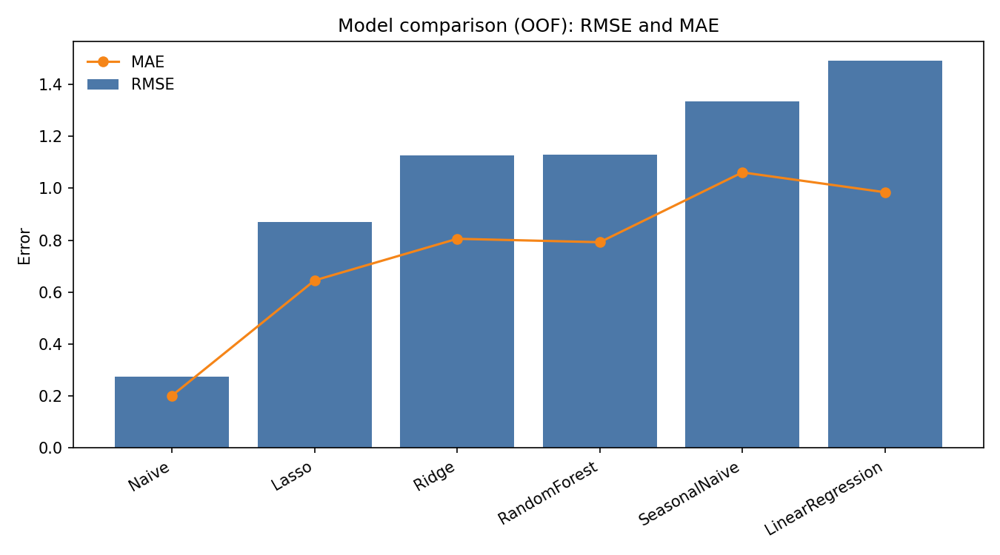{ width=68% }

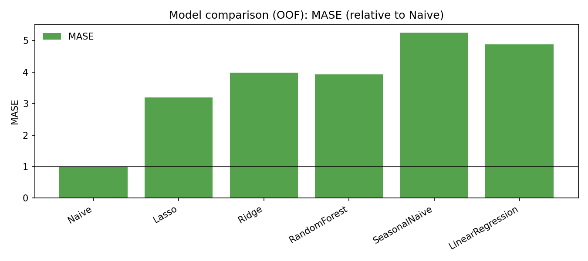{ width=68% }

\FloatBarrier

**3 month ahead forecasts (h = 3)**

| Model             | RMSE   | MAE   | MASE | n_samples |
|-------------------|--------|-------|------|-----------|
| Naive             | 0.56   | 0.41  | 1.00 | 255       |
| Lasso             | 1.03   | 0.79  | 1.92 | 255       |
| Ridge             | 1.11   | 0.87  | 2.09 | 255       |
| Linear Regression | 1.20   | 0.92  | 2.22 | 255       |
| Seasonal Naive    | 1.33   | 1.06  | 2.56 | 255       |
| Random Forest     | 1.36   | 1.04  | 2.51 | 255       |

*Table 3: OOF performance for 3 month ahead CPI YoY forecasts (rounded values).*

At the 3 month horizon, the Naive forecast again sets a very strong benchmark. It remains the best performer across RMSE, MAE, and MASE. Some ML models, such as Lasso and Ridge, reduce their relative gap to Naive compared to the 1 month case (MASE around 1.9 and 2.1 rather than above 3 as before), but they still do not outperform the Naive baseline. Seasonal Naive improves relative to the 1 month horizon but continues to lag behind the simple Naive projection.

\begin{center}
\includegraphics[width=0.68\textwidth,height=0.33\textheight,keepaspectratio]{results/model_comparison_errors_h3.png}
\captionof{figure}{Model comparison for the 3 month ahead horizon ($h = 3$): RMSE (bars) and MAE (line). The lower the better.}
\end{center}

\begin{center}
\includegraphics[width=0.68\textwidth,height=0.33\textheight,keepaspectratio]{results/model_comparison_mase_h3.png}
\captionof{figure}{Model comparison for the 3 month ahead horizon ($h = 3$): MASE (relative to Naive). The lower the better and the Naive benchmark is 1.}
\end{center}

Overall, across both horizons, the main pattern is still that more complexity in the model does not translate into better short term CPI forecasts for Switzerland. The Naive baseline remains difficult to beat, and while ML models capture more variation in the training data, their out of sample errors are larger. The MASE metric makes this comparison transparent, none of the ML models achieve MASE < 1 at either horizon.

### Forecast summary
Beyond backtesting errors, the pipeline also produces a *current* point forecast for each model using the latest available observation in the sample. These values should be interpreted as operational forecasts (what each model would predict today), not as evidence of ex‑post accuracy, because we cannot say if these are good or bad forecasts until the realized CPI is observed.

**1 month ahead point forecasts (h = 1)**

| Model         | Forecast for CPI YoY at t+1 |
|--------------|-----------------------------:|
| Linear Regression | 0.257 |
| Ridge         | 0.274 |
| Lasso         | 0.280 |
| Random Forest | 0.139 |
| Naive         | 0.200 |
| Seasonal Naive| 0.600 |

The Linear Regression forecast is relatively close to the Naive benchmark (0.257 vs 0.200), which is a plausible outcome in this setting because the dominant predictor is typically very recent inflation. The other models are neither great nor way off the mark. A linear model with lagged inflation features often learns a forecast that is “mostly persistence plus small adjustments” from other predictors (energy, FX, rates, etc). In other words, even when OOF evaluation shows that Naive is hard to beat, a linear model can still produce a  forecast point that looks reasonable because it largely tracks the same persistence signal. 

The Seasonal Naive value is 0.600 because this baseline is defined as $\hat{\pi}_{t+1\mid t}=\pi_{t-12}$, so it simply copies the CPI YoY observed 12 months earlier, which did equal 0.6 in the latest available month for this horizon.

**3 month ahead point forecasts (h = 3)**

| Model         | Forecast for CPI YoY at t+3 |
|--------------|-----------------------------:|
| Linear Regression | 0.354 |
| Ridge         | 0.308 |
| Lasso         | 0.011 |
| Random Forest | -0.082 |
| Naive         | 0.200 |
| Seasonal Naive| 0.600 |

At the 3 month horizon, forecasts are becoming more diverse between the different model classes. This is expected because first the horizon is longer so uncertainty increases, and second models can react differently to the current configuration of predictors and lagged signals. For example, Lasso ,which shrinks many coefficients to zero, can produce a much lower forecast if only a small subset of predictors remains active and their weighted combination implies disinflation. Then, Random Forests can also extrapolate nonlinear patterns and may give negative values when recent feature configurations resemble to past low‑inflation regimes. What is really important is, that these point forecasts should be read alongside the backtesting evidence. Because even if a forecast “looks fine” numerically, the OOF results indicate that these ML models have not been reliably more accurate than the Naive baseline.

## Visualizations
To complement the numerical metrics, the project produces a set of diagnostic plots saved in the results directory for each horizon. For every model, an out of fold (OOF) time series plot compares the actual CPI YoY series to the corresponding OOF predictions, making it easy to see periods where models systematically under or over predict inflation. These plots are particularly informative around turning points, where most models struggle relative to the Naive benchmark. 

In addition, permutation based feature importance and correlation heatmaps help interpret which predictors drive the ML models’ forecasts, even though these models do not outperform the baselines in terms of aggregate error.

**Permutation importance (Lasso)**

We report permutation importance for the Lasso model because it is a simple, regularized and relatively interpretable benchmark among the ML models, making it a reasonable choice for illustrating which engineered predictors drive a linear forecast.

| h = 1 | h = 3 |
|:---:|:---:|
| 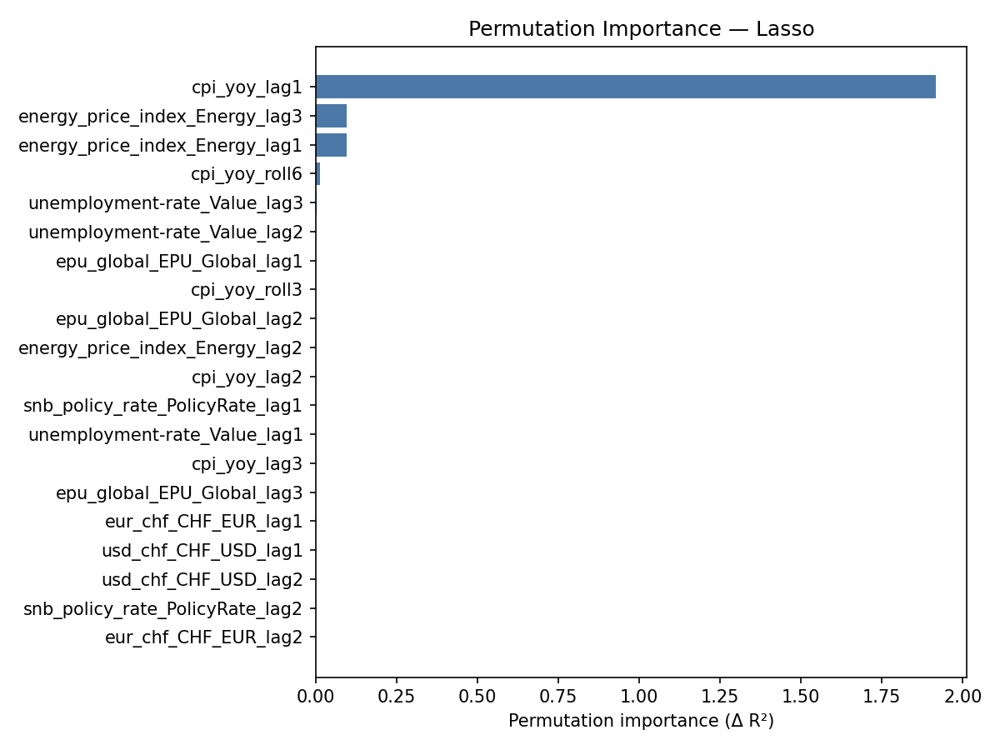{ width=0.49\\textwidth } | { width=0.49\\textwidth } |

*Table 4: Permutation importance (Lasso) for h = 1 and h = 3.*

Across both horizons, the dominant driver is the first lag of inflation ($\pi_{t-1}$), which is consistent with strong persistence in Swiss CPI YoY. Energy price lags are the second most informative predictors, and their importance becomes slightly more pronounced at the 3 month horizon. Other variables (unemployment, policy rate, EPU, and exchange rates) show relatively small or even inexistant incremental contribution in this benchmark. This suggests that most predictive power comes from recent inflation and energy dynamics.

\newpage
**Correlation heatmaps**

| h = 1 | h = 3 |
|:---:|:---:|
| 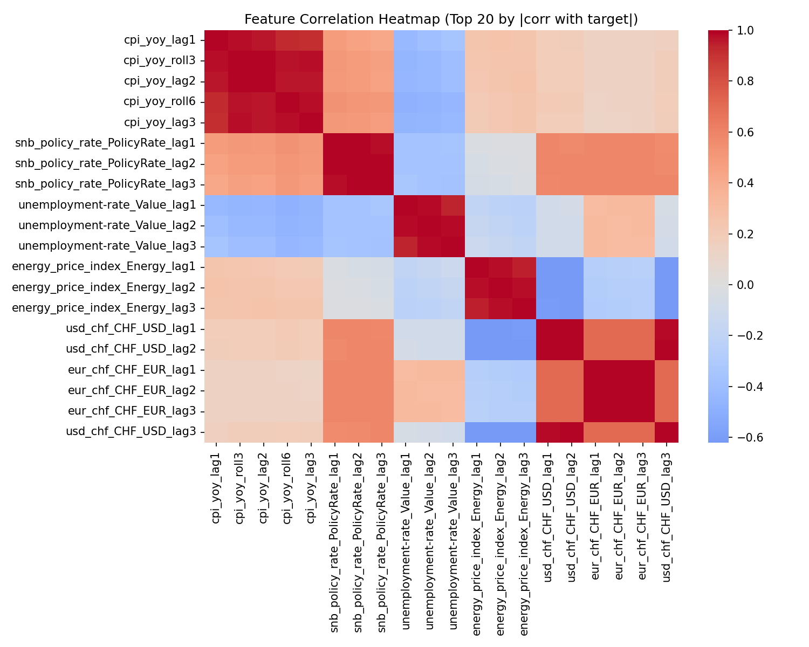{ width=0.49\\textwidth } | 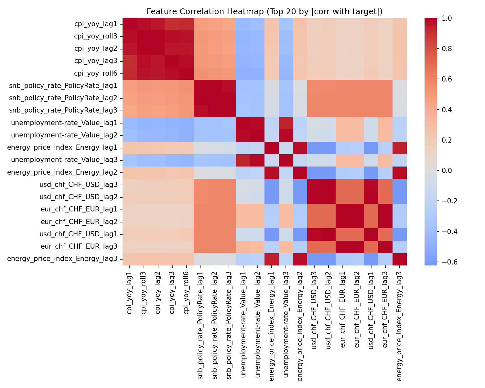{ width=0.49\\textwidth } |

*Table 5: Correlation heatmaps for the engineered features at h = 1 and h = 3.*

The heatmaps show strong dependence structures in the engineered features. Logically, lagged CPI YoY variables are highly correlated with each other (this is persistence), and rolling summaries of CPI naturally co-move with nearby lags. Similar patterns of collinearity also arise within other predictors, such as lagged energy price indices. This structure makes regularized linear models like Ridge and Lasso well suited to the problem and helps explain why estimated “importance” tends to concentrate on a small subset of stable signals.

# Discussion

This project’s main result is that, at short horizons (1 and 3 months), the Naive baseline is difficult to beat for Swiss CPI YoY. This is also consistent with the broader inflation forecasting literature, which often finds that simple persistence based benchmarks perform strongly at short horizons.

Overall, I think that the forecasting pipeline is robust and realistic. The features are constructed with the forecast horizon in mind, the cross validation respects the time ordering of the data, and the model evaluation relies on out of fold predictions. Actually all of this help limit look ahead bias. Reporting multiple metrics (RMSE, MAE, and especially MASE) also helps interpretation. The MASE makes the baseline comparison explicit, showing that ML models did not achieve MASE < 1 at either horizon.

**Why the Naive baseline is so strong :**

 Well the Swiss CPI YoY is highly persistent and relatively smooth from month to month, we can think “tomorrow looks like today” and it would be quite precise. Many of the engineered predictors capture essentially the same underlying persistence in inflation, which means that more complex models often simply end up reproducing the Naive forecast with only minor adjustments. In fact, exogenous predictors add limited incremental information at these horizons. The estimation noise from fitting multivariate models can easily dominate any small signal and lead to worse out of sample errors. Adding more and more predictors/informations doesn't actually help the forecast, it undermines it.
\newpage
**Comparison with expectations :**

 The initial hypothesis was that regularized linear models or Random Forests might exploit information from exchange rates, energy, policy, unemployment, uncertainty, or Google Trends to improve near term accuracy. The results do not support this at the 1 and 3 month horizons: Naive dominates on RMSE/MAE/MASE, while ML models (especially at h = 1) exhibit substantially higher errors. A nuance is that the gap narrows somewhat at h = 3 for some linear models (e.g., Lasso/Ridge), which is consistent with the idea that exogenous signals may matter more as the horizon increases, but in this sample they remain insufficient to outperform persistence.

**Limitations:**

- The dataset is relatively small for ML as we only have monthly data over roughly two decades. Unfortunately, it increases estimation variance and increases the risk of overfitting in nonlinear models.
- We used a limited set of predictors and fixed hyperparameters, so the ML models may not be optimized for the best possible performance.
- The 12 month structure of YoY inflation increases persistence and constrains short horizon improvements.
- Model performance can be dependent of the regime, for example, structural breaks such as energy shocks may require time varying parameters or richer feature sets.

**Diagnostic interpretation:** 

The permutation importance chart and the correlation heatmaps suggest that most of the predictive power in the linear benchmark comes from lagged inflation and energy related features. Other predictors contribute unfortunately little at the margin. High collinearity among lags and rolling features also supports the use of regularization (Ridge and Lasso), but the results should be interpreted with caution. When predictors are strongly correlated, importance may be attributed to a single variable even though the underlying signal is shared across several features.

Overall, the key takeaway is that for short horizon Swiss CPI YoY forecasting, a strong baseline such as Naive should be the reference point, and any other more complex model should be justified by consistent, out of sample improvements relative to that baseline.

# Conclusion

This project examined whether commonly used machine learning models can outperform strong persistence benchmarks when forecasting Swiss CPI inflation on a year over year basis. Using horizon specific features and a rolling time series cross validation framework with out of fold evaluation, the findings are unambiguous. At both one and three month horizons, increased model complexity does not lead to lower forecast errors.

- **Summary of key findings :** Across both horizons, the Naive baseline delivers the lowest RMSE/MAE and is the reference point for MASE (MASE = 1). All ML models have MASE > 1, with particularly large underperformance at $h=1$, it clearly shows that short term Swiss CPI YoY is highly persistent and difficult to improve with models in this sample.
- **Recommendations :** For short term forecasting ($h\in\{1,3\}$ months) in this dataset, obviously use Naive as the default benchmark and production forecast because it is accurate, robust, and easy to maintain. The ML models can be used mainly as diagnostic tools, for example to explore whether energy/FX signals matter in specific periods, rather than as replacements for the baseline.
- **Future work :**  We could evaluate longer horizons like 6 or 12 months, where exogenous information may matter more. We could also expand the feature set and data coverage (additional domestic activity indicators, richer commodity measures, alternative inflation measures). Otherwise maybe another test could be to forecast combinations (simple averaging, weighted ensembles) and assess forecast dominance formally (e.g, Diebold–Mariano tests).
 
\newpage

# References

Atkeson, A. & Ohanian, L. E. (2001). *Are Phillips curves useful for forecasting inflation?* Federal Reserve Bank of Minneapolis Quarterly Review, 25(1), 2–11.

Stock, J. H. & Watson, M. W. (2007). *Why has U.S. inflation become harder to forecast?* Journal of Money, Credit and Banking, 39(s1), 3–33.

Stock, J. H. & Watson, M. W. (2008). *Phillips curve inflation forecasts*. In J. Y. Campbell (Ed.), NBER Macroeconomics Annual 2007 (Vol. 22, pp. 101–186). University of Chicago Press.

Medeiros, M. C., Vasconcelos, G. F. R., Veiga, Á., & Zilberman, E. (2019). *Forecasting inflation in a data‑rich environment: The benefits of machine learning methods*. Journal of Business & Economic Statistics, 37(2), 205–219.

Kelly, L., Binner, J., & Tepper, J. A. (2024). *Do Monetary Aggregates Improve Inflation Forecasting in Switzerland?* Journal of Management Policy and Practice, 25(1), 124–133.

## Data Sources

Swiss National Bank (SNB). (2025). *SNB Data Portal (time series for Switzerland)*. Retrieved December 2025, from https://data.snb.ch/

Federal Statistical Office (FSO/OFS). (2025). *Swiss labour market and unemployment statistics (SECO/OFS publications and time series)*. Retrieved December 2025, from https://www.bfs.admin.ch/

Baker, S. R., Bloom, N., & Davis, S. J. (2025). *Economic Policy Uncertainty Index (global series)*. Retrieved December 2025, from https://www.policyuncertainty.com/

Google. (2025). *Google Trends (search interest index)*. Retrieved December 2025, from https://trends.google.com/

## Software and Libraries

Python Software Foundation. (2025). *Python (Version 3.11)*. https://www.python.org/

McKinney, W. (2025). *pandas: Powerful data structures for data analysis*. https://pandas.pydata.org/

Harris, C. R., et al. (2020). Array programming with NumPy. *Nature*, 585, 357–362. https://numpy.org/

Pedregosa, F., et al. (2011). Scikit-learn: Machine learning in Python. *Journal of Machine Learning Research*, 12, 2825–2830. https://scikit-learn.org/

Hunter, J. D. (2007). Matplotlib: A 2D graphics environment. *Computing in Science & Engineering*, 9(3), 90–95. https://matplotlib.org/

Waskom, M. L. (2021). seaborn: Statistical data visualization. *Journal of Open Source Software*, 6(60), 3021. https://seaborn.pydata.org/

Seabold, S., & Perktold, J. (2010). Statsmodels: Econometric and statistical modeling with Python. In *Proceedings of the 9th Python in Science Conference*. https://www.statsmodels.org/

Joblib development team. (2025). *joblib: Running Python functions as pipeline jobs*. https://joblib.readthedocs.io/

Python-dateutil contributors. (2025). *python-dateutil: Extensions to the standard Python datetime module*. https://dateutil.readthedocs.io/

Reitz, K., & contributors. (2025). *requests: HTTP for Humans*. https://requests.readthedocs.io/

General Mills, Inc., & contributors. (2025). *pytrends: Unofficial Google Trends API*. https://github.com/GeneralMills/pytrends

**Development Tools:** Analysis implemented with assistance from both GitHub Copilot and ChatGPT, and also used for code organization and documentation. Human supervision involved in all technical choices, verifications, and research orientation.

\newpage

# Appendices

## Appendix A: Additional Results

This appendix reports the out of fold (OOF) prediction plots for the 3 month ahead horizon ($h=3$) for each model. Each plot compares actual CPI YoY to OOF predictions, highlighting how well the model tracks persistence and turning points in a realistic backtesting setting. The same set of plots was also produced for the 1-month-ahead horizon ($h=1$).

| Naive (h = 3) | Seasonal-Naive (h = 3) |
|:---:|:---:|
| 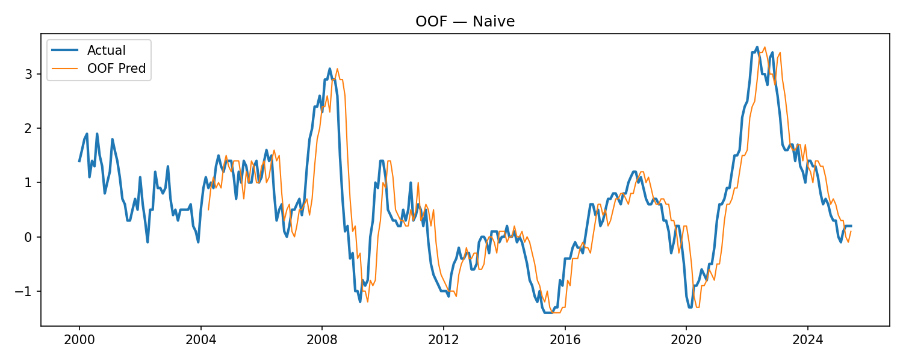{ width=0.49\\textwidth } | 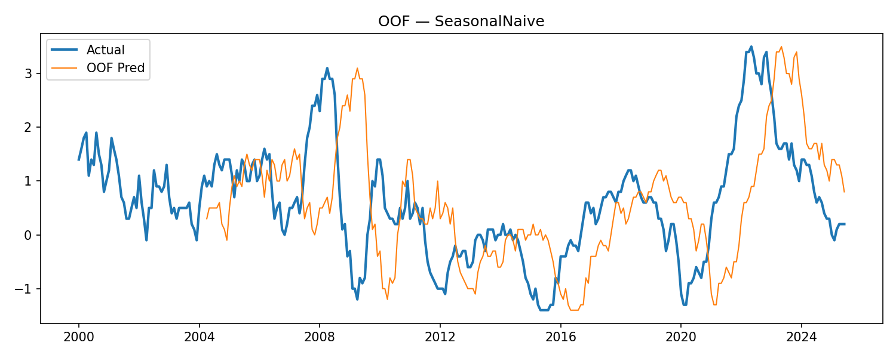{ width=0.49\\textwidth } |
| Tracks the series closely because Swiss CPI YoY is highly persistent as said before. It serves as a strong benchmark. | Can miss short run shifts because it anchors on the 12-month lag, which may be misaligned in changing regimes. |

| Linear Regression (h = 3) | Ridge (h = 3) |
|:---:|:---:|
| 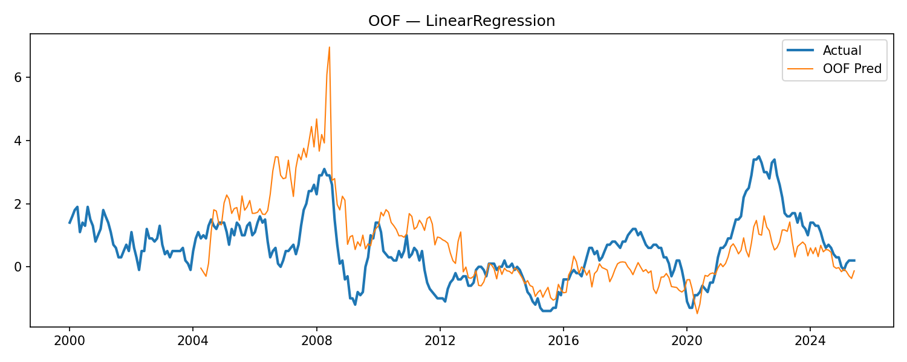{ width=0.49\\textwidth } | 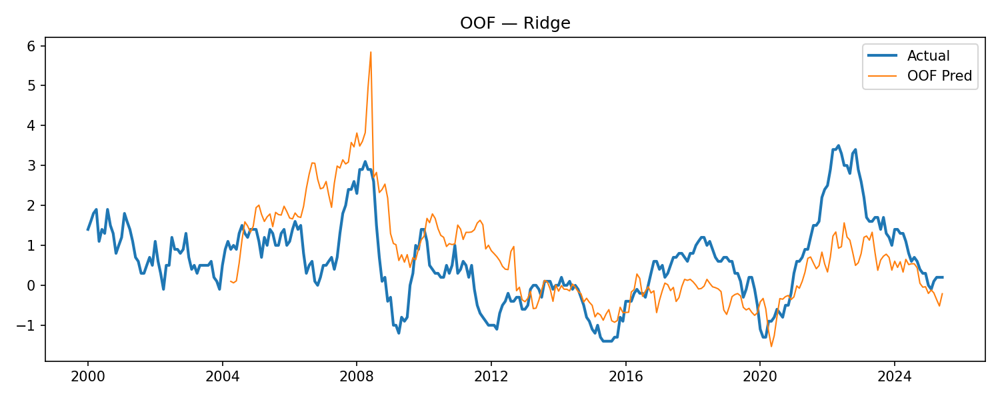{ width=0.49\\textwidth } |
| Often behaves like persistence with small adjustments from other predictors but errors appear around turning points. | Regularization help to stabilize coefficient estimates in the presence of collinearity |

| Lasso (h = 3) | Random Forest (h = 3) |
|:---:|:---:|
| 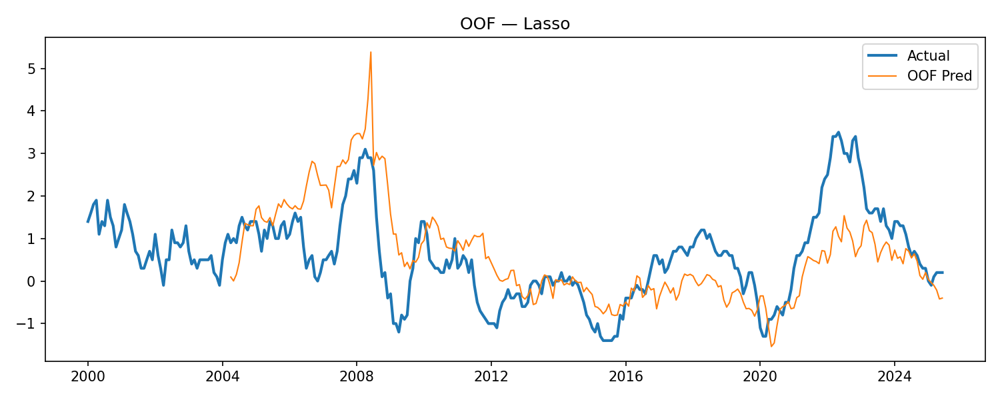{ width=0.49\\textwidth } | 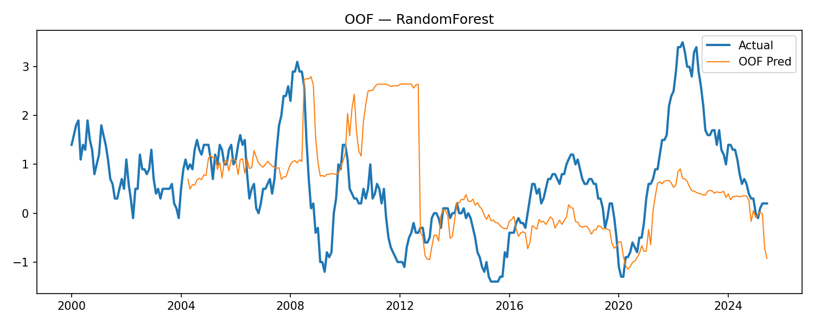{ width=0.49\\textwidth } |
| When signals are spread across correlated lags, sparsity can cause underreaction and slow adjustment during rapid changes | Captures nonlinear patterns in-sample, but can overfit and produce less stable OOF paths at this sample size. |